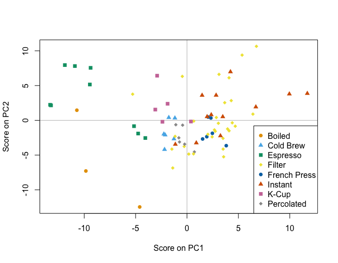

# Coffee brew study
This repository contains scripts for the analysis of data from the coffee brew metabolomics study.

_Scores plot of principal component analysis of intensities of 64 known compounds measured in a range of coffee brews._

`Boxplots_coffee_features.R` generates boxplots of intensity distributions for spectral features found in coffee brews.

`Brew_exploratory.R` is an exploratory analysis of multivarate metabolomics data, performing a PCA to determine the main sources of variation in the data.

`Brew_targeted_analysis.R` is an analysis of known compounds in coffee brews, for all brew types and by filter coffees only. The major components of variation are determined and the compounds which contribute most to these.

`Top_features.R` is a function to find the most intense features in different brew subgroups.

`PCPR2_coffee.R` and `PCPR2_vectorised.R` perform the PCPR2 technique on untargeted data.